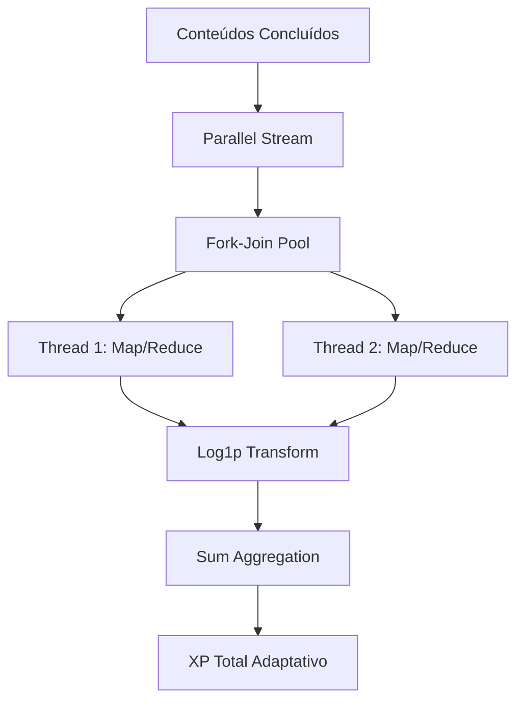

# Sistema de Cálculo de XP com Paralelismo Adaptativo em Java

## Visão Geral
Este projeto é uma simulação de um sistema de aprendizado baseado em XP (experiência), modelado a partir de princípios de computação funcional, paralelismo fork-join, e progressão logarítmica adaptativa.

A base é simples: cada conteúdo consumido por um "Dev" no bootcamp fornece uma quantidade de XP, mas o crescimento dessa experiência não é linear. É controlado por funções matemáticas que modelam realismo cognitivo.

No caso, implementei um sistema de progressão baseado em XP (experiência), modelando o aprendizado de um desenvolvedor ao longo de um bootcamp, em que conteúdos consumidos (cursos, mentorias) geram unidades de XP que são transformadas, agregadas e reduzidas através de técnicas de processamento paralelo. 

O objetivo é evitar o acumulo de pontos de forma linear através de logaritmos, onde dado que ele esta para exponencialização(^) como a divisão(/) estára para a multiplicação(*), consegui reduzir a progreção para algo mais realista.

Usei um fluxo funcional (`stream`, `map`, `reduce`) e execução concorrente (`parallelStream`, `ForkJoinPool`) para realizar uma agregação segura e escalável, sem estado compartilhado

---

## Diagrama do Projeto



```
bootcamp-java-hpc.zip
├── src/
    ├── domain/
    │   ├── Conteudo.java, Curso.java, Mentoria.java, Bootcamp.java, Dev.java
    ├── engine/
    │   ├── LearningEngine.java, ParallelProcessor.java
    └── ui/
        └── Main.java

```
---

## Modelo de XP com Transformação Logarítmica

A função de XP é não linear, simulando uma curva de aprendizado com rendimentos decrescentes, ou seja, quanto maior a progreção, menos ele cresce. O core da fórmula:

```java
XP = Math.log1p(rawXp) * 15
```

* `rawXp`: valor linear derivada da carga horária do curso ou mentoria(ex: 10 × horas de curso)
* `log1p(x)`: log natural de (1 + x), evita `log(0)` assim removendo o BO de descontinuidade
* `* 15`: normalização para valores humanos (\~10–100)

Isso resultan em uma curva de progressão suavemente crescente que se estabiliza com o tempo, refletindo a dificuldade incremental de absorção de conhecimento, ou seja, significa que **dobrar a carga horária não dobra o XP**, pois o conhecimento marginal tem peso reduzido.

---

## Paralelismo Fork-Join com Imutabilidade

A JVM oferece, nativamente, o `ForkJoinPool.commonPool()` como backbone para operações `parallelStream()` e o usei sobre o conjunto de conteúdos concluídos, resultando em execução concorrente por múltiplos núcleos. 

**Como funciona:**

* Os dados são **fatiados automaticamente** em pequenos blocos(splits) e cada fragmento é alocado
* Cada bloco é processado em uma thread independente e totalmente isolada
* O sistema aplica `map()` → `reduce()` sem sincronismo explícito reduzindo os resultados parciais em um unico valor agregado

O objetivo é  treinar paralelismo e através dessa operação, garanto o caráter imutável das transformações: nenhuma thread compartilha estado com outra, e não há sincronização explícita (`synchronized`, `wait`, `notify`). 

A operação é puramente funcional, garantindo comutatividade e idempotência, além disso, também permite que a execução escale horizontalmente sem risco de deadlocks, race conditions ou corrupção de dados intermediários.

---

## Otimizações de Baixo Nível via JIT
> Aqui é puramente para estudo, e gosto de explicar, então meio que né?¯\_(ツ)_/¯

O compilador JIT (Just-In-Time) é meu xodozinho que identifica caminhos de execução recorrentes (hotpaths) e os compila dinamicamente para código de máquina nativo e através de inlining de lambdas, eliminação de código morto e remoção de overhead de abstrações funcionais ele transforma essa gambiarra em código funcional.

Apesar da otimização, tecnicas de HPC podem ser uteis, como o uso de `mapToDouble`, que converte objetos em valores primitivos, evitando o custo de autoboxing e reduzindo o consumo de heap, melhorando a performance e a previsibilidade do coletor de lixo (GC), uma vez que objetos temporários são minimizados e alocados diretamente na stack, sempre que possível(~~sim, sou autista nesse nivel~~).

---

## Generalização com Tipos Genéricos

Também utilizei interfaces funcionais como `Function<T, R>` permite a abstração de transformações genéricas aplicáveis a qualquer tipo de entrada (`T`) e saída (`R`), pois assim viabiliza operações como mapeamento paralelo e redução em domínios arbitrários, desde que se respeite a imutabilidade e ausência de efeitos colaterais.

Por exemplo, o método `processInParallel` recebe uma lista de entradas e uma função de transformação, aplicando essa função a cada item em paralelo e retornando uma lista com os resultados. Já `processInParallelAndConsume` executa uma função sobre cada elemento sem esperar retorno, útil para efeitos colaterais controlados (como logging, persistência ou métricas).

---

## Simulação Cognitiva e Ontologia Computacional
> A partir daqui modelei um sistema metacognitivo baseado em nós autonomos operando numa matriz densa, em que cada um é uma instancia em parametros diferentes que afetam o espaço n-dimensional(modelei baseado no comportamento humano, mas já que era um negócio tão denso, decidi deixar pro chatBot explicar)

A modelagem adotada no projeto não é apenas técnica, mas também filosófica. O paralelismo aqui não é meramente uma estratégia de otimização, mas sim uma representação computacional de como instâncias cognitivas independentes (ex: `Dev`) interagem com o conhecimento (ex: `Conteudo`) em uma topologia de propagação.

Cada elemento é tratado como um nó autônomo em um grafo de execução. O sistema assume que as ideias (conteúdos) são propagadas e absorvidas como sinais informacionais que se transformam em experiência. Esse modelo se aproxima de uma visão funcional do mundo, onde o fluxo de dados e transformações representam o próprio aprendizado como uma estrutura computável.

---

## Técnicas Centrais Utilizadas

| Técnica                   | Implementação                           | Efeito                                                |
| ------------------------- | --------------------------------------- | ----------------------------------------------------- |
| Redução paralela          | `parallelStream().mapToDouble().sum()`  | Processamento simultâneo de conteúdos                 |
| Transformação logarítmica | `Math.log1p(x) * 15`                    | Compressão de valores brutos para progressão realista |
| Stateless lambdas         | `c -> calcularXp(c)`                    | Evita interferência entre threads                     |
| Autoboxing avoidance      | `mapToDouble` em vez de `map(Double::)` | Melhora uso de memória e performance                  |
| Genéricos com `Function`  | `Function<T, R>`                        | Permite composição funcional reutilizável             |

---

## Possíveis Extensões

* Adoção de TornadoVM para execução em GPU via OpenCL
* Curvas de nível baseadas em funções sigmoid ou softmax
* Divisão do XP em múltiplas dimensões (técnico, interpessoal, etc.)
* Implementação de tracking histórico com persistência por evento


package domain;

import java.time.LocalDate;
import java.util.LinkedHashSet;
import java.util.HashSet;
import java.util.Set;

public class Bootcamp {
    private String nome;
    private String descricao;
    private final LocalDate dataInicio = LocalDate.now();
    private final LocalDate dataFim = dataInicio.plusDays(45);
    private Set<Dev> devsInscritos = new HashSet<>();
    private Set<Conteudo> conteudos = new LinkedHashSet<>();
    
    public String getNome() {  return nome;  }
    public void setNome(String nome) {  this.nome = nome;  }
    public String getDescricao() {  return descricao;  }
    public void setDescricao(String descricao) {  this.descricao = descricao;  }
    public LocalDate getDataInicio() {  return dataInicio;  }
    public LocalDate getDataFim() {  return dataFim;  }
    public Set<Dev> getDevsInscritos() {  return devsInscritos;  }
    public void setDevsInscritos(Set<Dev> devsInscritos) {  this.devsInscritos = devsInscritos;  }
    public Set<Conteudo> getConteudos() {  return conteudos;  }
    public void setConteudos(Set<Conteudo> conteudos) {  this.conteudos = conteudos;  }
}

package domain;

// This mock file is used to study the Java


public abstract class Conteudo {
    protected static final double XP_PADRAO = 10d;

    private String titulo;
    private String descricao;

    public abstract double calcularXp();

    public String getTitulo() {
        return titulo;
    }
    
    public void setTitulo(String titulo) {
        this.titulo = titulo;
    }
    
    public String getDescricao() {
        return descricao;
    }

    public void setDescricao(String descricao) {
        this.descricao = descricao;
    }
}
package domain;

public class Curso extends Conteudo {

    private int cargaHoraria;


    @Override
    public double calcularXp() {
        return XP_PADRAO * cargaHoraria;
    }

    public int getCargaHoraria() {
        return cargaHoraria;
    }

    public void setCargaHoraria(int cargaHoraria) {
        this.cargaHoraria = cargaHoraria;
    }
    
}
package domain;
import engine.LearningEngine;

import java.util.*;

public class Dev {
    private String nome;
    private Set<Conteudo> conteudosInscritos = new LinkedHashSet<>();
    private Set<Conteudo> conteudosConcluidos = new LinkedHashSet<>();

    public void inscreverBootcamp(Bootcamp bootcamp) {
        this.conteudosInscritos.addAll(bootcamp.getConteudos());
        bootcamp.getDevsInscritos().add(this);
    }

    public void progredir() {
        Optional<Conteudo> conteudo = this.conteudosInscritos.stream().findFirst();
        if (conteudo.isPresent()) {
            this.conteudosConcluidos.add(conteudo.get());
            this.conteudosInscritos.remove(conteudo.get());
        } else {
            System.err.println("Você não está matriculado em nenhum conteúdo!");
        }
    }

    public double calcularTotalXp() {
        return LearningEngine.calcularTotalXpParalelo(this.conteudosConcluidos);
    }

    public String getNome() {  return nome;  }

    public void setNome(String nome) {  this.nome = nome;  }

    public Set<Conteudo> getConteudosInscritos() {  return conteudosInscritos; }

    public Set<Conteudo> getConteudosConcluidos() {  return conteudosConcluidos;  }
}
package domain;

import java.time.LocalDate;

public class Mentoria extends Conteudo {
    
    private LocalDate data;

    @Override
    public double calcularXp() {
        return XP_PADRAO + 20d;
    }

    public LocalDate getData() {
        return data;
    }

    public void setData(LocalDate data) {
        this.data = data;
    }
    
}
package engine;

import domain.Conteudo;
import domain.Curso;
import domain.Mentoria;

import java.util.Set;

public class LearningEngine {

    public static double calcularTotalXpParalelo(Set<Conteudo> conteudosConcluidos) {
        return conteudosConcluidos
                .parallelStream()
                .mapToDouble(conteudo -> {
                    double rawXp = 0;

                    if (conteudo instanceof Curso curso) {
                        rawXp = 10d * curso.getCargaHoraria();
                    } else if (conteudo instanceof Mentoria) {
                        rawXp = 30d;
                    } else {
                        rawXp = 10d;
                    }

                    
                    return Math.log1p(rawXp) * 15; 
                })
                .sum();
    }
}
package engine;

import java.util.List;
import java.util.function.Function;
import java.util.stream.Collectors;

public class ParallelProcessor {
    public static <T, R> List<R> processInParallel(List<T> items, Function<T, R> processor) {
        return items.parallelStream()
                    .map(processor)
                    .collect(Collectors.toList());
    }
    public static <T> void processInParallelAndConsume(List<T> items, Function<T, Void> consumer) {
        items.parallelStream()
              .forEach(consumer::apply);
    }
}
