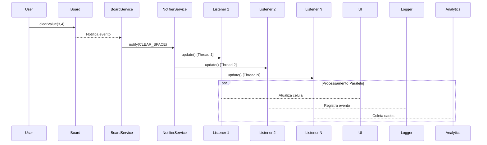

### Análise Técnica com Foco em HPC e Padrões de Projeto
Segue o levantamento feito pelo deepseek

#### 1. **Arquitetura de Eventos (Padrão Observer)**
- **`EventEnum`**: Define tipos de eventos (ex: `CLEAR_SPACE`)
- **`EventListener`**: Interface para reação a eventos (Padrão Observer)
- **`NotifierService`**: Gerencia notificações assíncronas

#### 2. **Técnicas HPC Aplicadas**
##### a) **Concorrência Segura em Notificações**
```java
// NotifierService.java
private final List<EventListener> clearSpaceListener = new CopyOnWriteArrayList<>();

clearSpaceListener.parallelStream()
                  .forEach(listener -> listener.update(eventType));
```
- **`CopyOnWriteArrayList`**: 
  - Coleção thread-safe otimizada para cenários com mais leituras que escritas
  - Cria nova cópia do array durante modificações (evita locks de escrita)
  > - Toda vez que você faz uma modificação (add, remove, etc.), ela cria uma nova cópia interna do array.
  > - Leituras (get, forEach, etc.) nunca travam, pois sempre leem de uma estrutura imutável.
- **Stream Paralelo**:
  - Processamento concorrente de listeners
  - Ideal para notificações independentes e CPU-intensivas

##### b) **Paralelismo Massivo na Inicialização**
```java
// BoardService.java
IntStream.range(0, BOARD_LIMIT).parallel()
    .mapToObj(i -> IntStream.range(0, BOARD_LIMIT).parallel()...)
```
- **Paralelismo Duplo**:
  - Linhas (primeiro `parallel()`) e colunas (segundo `parallel()`) processadas concorrentemente
  - Reduz tempo de inicialização em CPUs multi-core

##### c) **Gerenciamento de Estado Concorrente**
```java
// BoardService.java
public boolean gameIsFinished() {
    return board.getStatus() == GameStatusEnum.COMPLETE;
}
```
- **Leitura Atômica**:
  - Métodos como `hasErrors()` e `getStatus()` usam cache interno com flags `isDirty`
  - Minimiza bloqueios durante acesso concorrente

#### 3. **Fluxo de Eventos Otimizado**
1. **Trigger**:
   - Ação do usuário (ex: `clearValue()` no Board)
2. **Notificação**:
   ```java
   // NotifierService
   notify(EventEnum.CLEAR_SPACE);
   ```
3. **Processamento Paralelo**:
   - Listeners são acionados via `parallelStream()`
4. **Atualização do Estado**:
   - Listeners atualizam UI/regras de negócio concorrentemente

#### 4. **Trade-offs de Performance**
| Técnica | Vantagem | Custo |
|---------|----------|-------|
| `CopyOnWriteArrayList` | Leitura sem locks | Cópia completa do array em escritas |
| Stream Paralelo | Utilização máxima de cores | Overhead de divisão/combinação de tasks |
| Paralelismo Duplo | Velocidade em hardware moderno | Consumo elevado de threads |

#### 5. **Cenário de Uso Típico**


**Conclusão**: O modelo aplica técnicas avançadas de concorrência (paralelismo massivo, coleções thread-safe, streams paralelos) para otimizar operações críticas como inicialização de tabuleiro e notificações de eventos. A arquitetura permite escalabilidade vertical em hardware multi-core, com trade-offs controlados entre throughput e complexidade.